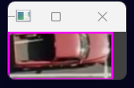
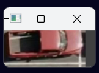
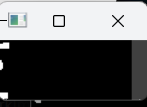

<a name="readme-top"></a>

[![Contributors][contributors-shield]][contributors-url]
[![Forks][forks-shield]][forks-url]
[![Stargazers][stars-shield]][stars-url]
[![Issues][issues-shield]][issues-url]
[![MIT License][license-shield]][license-url]
[![LinkedIn][linkedin-shield]][linkedin-url]

<!-- PROJECT LOGO -->
<br />
<div align="center">
  <a href="https://github.com/alperrkilic/Parking-Space-Counter-Project">
    
  </a>

  <h3 align="center">Parking Space Counter</h3>

  <p align="center">
    A Parking Space Counter Project
    <br />
    <a href="https://github.com/alperrkilic/Parking-Space-Counter-Project"><strong>Explore the docs »</strong></a>
    <br />
    <br />
    <a href="https://github.com/alperrkilic/Parking-Space-Counter-Project">View Demo</a>
    ·
    <a href="https://github.com/alperrkilic/Parking-Space-Counter-Project/issues">Report Bug</a>
    ·
    <a href="https://github.com/alperrkilic/Parking-Space-Counter-Project/issues">Request Feature</a>
  </p>
</div>


<!-- TABLE OF CONTENTS -->
<details>
  <summary>Table of Contents</summary>
  <ol>
    <li>
      <a href="#about-the-project">About The Project</a>
      <ul>
        <li><a href="#built-with">Built With</a></li>
      </ul>
    </li>
    <li>
      <a href="#getting-started">Getting Started</a>
      <ul>
        <li><a href="#prerequisites">Prerequisites</a></li>
        <li><a href="#installation">Installation</a></li>
      </ul>
    </li>
    <!-- <li><a href="#usage">Usage</a></li> -->
    <li><a href="#images">Images</a></li>
    <!-- <li><a href="#contributing">Contributing</a></li> -->
    <li><a href="#license">License</a></li>
    <li><a href="#contact">Contact</a></li>
    <li><a href="#acknowledgments">Acknowledgments</a></li>
  </ol>
</details>


<!-- ABOUT THE PROJECT -->
## About The Project

[![Product Name Screen Shot][product-screenshot]](https://github.com/alperrkilic/Parking-Space-Counter-Project)

The Parking Space Counter project is designed to help parking lot operators or drivers quickly and easily determine the number of available parking spaces in a lot. By using computer vision techniques to analyze video footage of the lot, the system can accurately count the number of open spaces and make this information available in real-time. This project can be easily applied to any parking space with just a camera and a computer, helping people find available parking spots quickly and easily.

Here's why:
* Saves time and reduces frustration: Finding a free parking space can be a challenge, especially in busy areas. With the Parking Space Counter, you can quickly and easily locate available parking spots without having to drive around and waste time searching.
* Increases efficiency and maximizes space utilization: By accurately counting the number of available parking spaces, the Parking Space Counter allows parking lot operators to make more informed decisions about space utilization. This can help increase efficiency, reduce congestion, and ultimately make the parking experience better for everyone involved.

In conclusion, the Parking Space Counter is a powerful tool that utilizes computer vision techniques to accurately count the number of available parking spaces in a given lot. With its customizable parameters and easy-to-use interface, the system is ideal for anyone looking to manage or navigate a busy parking lot. By using this tool, drivers can save time and reduce frustration, while parking lot operators can increase efficiency and maximize space utilization. Whether you're managing a large commercial lot or just looking for a free parking spot in a busy area, the Parking Space Counter is the solution you've been looking for.

<p align="right">(<a href="#readme-top">back to top</a>)</p>


### Built With

The Parking Space Counter is a project that uses OpenCV and Python to count the number of available parking spaces in a given parking lot.

* [![Python][Python]][Python-url]
* [![openCV][openCV]][openCV-url]


<p align="right">(<a href="#readme-top">back to top</a>)</p>


<!-- GETTING STARTED -->
## Getting Started

The Parking Space Counter is a project that uses OpenCV and Python to count the number of available parking spaces in a given parking lot. In this project, parking spaces are counted according to the pixels that are counted from a dilated image. If the number of pixels are above 900, then the space is considered to be not available. However, if the number of pixels are below 900, then the space is considered to be an empty parking space.

Additionally, this project includes a script called ParkingSpacePicker.py, which allows you to manually add a parking space to the list of spaces to be checked.

### Prerequisites

To install the required files, please enter the following commands into your terminal: 
* pip
  ```sh
  pip install opencv-python 
  ```
  ```sh
  pip install cvzone
  ```
  ```sh
  pip install numpy
  ```

### Installation

_Installing the Parking Space Counter is quick and easy. Follow these simple steps to get started in just a few minutes!_

1. Create your virtual environment with Pycharm
2. Clone the repository to your local machine:
   ```sh
   git clone https://github.com/alperrkilic/Parking-Space-Counter-Project
   ```
3. Install the required dependencies:
   ```sh
   pip install opencv-python numpy cvzone
   ```
   _Note: This project is built with Python 3.8, so make sure you have it installed on your machine._
4. Open the project in Visual Studio Code or your preferred code editor.
   ```js
   That's it! You're now ready to use the Parking Space Counter project.
   ```

<p align="right">(<a href="#readme-top">back to top</a>)</p>


<!-- USAGE EXAMPLES -->
<!-- ## Usage

Use this space to show useful examples of how a project can be used. Additional screenshots, code examples and demos work well in this space. You may also link to more resources.

_For more examples, please refer to the [Documentation](https://example.com)_

<p align="right">(<a href="#readme-top">back to top</a>)</p> -->


<!-- Images -->
## Images

[![Screen Shots][parking-spaces-to-be-checked]](https://github.com/alperrkilic/Parking-Space-Counter-Project)

_Places that are considered as parking spaces manually selected with ParkingSpacePicker.py_


<tr>
    <td>
      </img>
    </td>
    <td>
      </img>
    </td>
    
</tr>

_After selecting the parking spaces, storing them into CarParkPos file and splitting each frame that are selected with ParkingSpacePicker.py_

[![Screen Shots][blurred-img]](https://github.com/alperrkilic/Parking-Space-Counter-Project)

_Blurring the image after making it grayscale_

[![Screen Shots][threshold-img]](https://github.com/alperrkilic/Parking-Space-Counter-Project)

_Converting image into a binary image with Thresholding_

[![Screen Shots][dilated-img]](https://github.com/alperrkilic/Parking-Space-Counter-Project)

_After thresholding, to remove unwanted white pixels we are dilating the threshold image_

[![Screen Shots][median-img]](https://github.com/alperrkilic/Parking-Space-Counter-Project)

_To adjust the thickness, we're generating the median image_

<tr>
    <td>
      
      </img>
    </td>
    <td>
      
      </img>
    </td>
</tr>

_After dilation and median images, it's evident whether there's a car in a parking spot or not._

[![Screen Shots][spaces-with-counters]](https://github.com/alperrkilic/Parking-Space-Counter-Project)

_Now, on our original dilated image, we can count the white pixels and display their numbers on the image. If a parking space is empty, the number of white pixels is expected to be less than 900. However, if the number of white pixels is more than 900, it is an indication that there is a car present in the parking space._

[![Screen Shots][product-screenshot]](https://github.com/alperrkilic/Parking-Space-Counter-Project)

_Finally, we count the number of available parking spaces and draw rectangles around each parking spot. If a parking space is available, we mark it with a green color, and if it is occupied, we mark it with a red color._

See the [main.py](https://github.com/alperrkilic/Parking-Space-Counter-Project/blob/master/main.py) for the detailed explanations on the code.

<p align="right">(<a href="#readme-top">back to top</a>)</p>


<!-- CONTRIBUTING -->
<!-- ## Contributing

Contributions are what make the open source community such an amazing place to learn, inspire, and create. Any contributions you make are **greatly appreciated**.

If you have a suggestion that would make this better, please fork the repo and create a pull request. You can also simply open an issue with the tag "enhancement".
Don't forget to give the project a star! Thanks again!

1. Fork the Project
2. Create your Feature Branch (`git checkout -b feature/AmazingFeature`)
3. Commit your Changes (`git commit -m 'Add some AmazingFeature'`)
4. Push to the Branch (`git push origin feature/AmazingFeature`)
5. Open a Pull Request

<p align="right">(<a href="#readme-top">back to top</a>)</p> -->


<!-- LICENSE -->
## License

Distributed under the MIT License. See `LICENSE.txt` for more information.

<p align="right">(<a href="#readme-top">back to top</a>)</p>


<!-- CONTACT -->
## Contact

Bayram Alper KILIÇ - [@alperrkilic](https://www.linkedin.com/in/bayram-alper-kilic/) - alperkilicbusiness@gmail.com

Project Link: [https://github.com/alperrkilic/Parking-Space-Counter-Project](https://github.com/alperrkilic/Parking-Space-Counter-Project)

<p align="right">(<a href="#readme-top">back to top</a>)</p>


<!-- ACKNOWLEDGMENTS -->
## Acknowledgments

Creating a project like the Parking Space Counter requires a lot of research, experimentation, and dedication. I would like to take this opportunity to acknowledge and thank the many individuals, channels, and websites that helped me along the way. Without their guidance and support, this project would not have been possible. In particular, I would like to recommend the following channels and websites for their invaluable resources and contributions to the field of computer vision and image processing.

* [Computer Vision Zone](https://www.computervision.zone/)
* [Murtaza's Workshop - Robotics and AI](https://www.youtube.com/@murtazasworkshop)
* [ChatGPT](https://chat.openai.com/chat)
* [Choose an Open Source License](https://choosealicense.com)
* [Img Shields](https://shields.io)


<p align="right">(<a href="#readme-top">back to top</a>)</p>

[contributors-shield]: https://img.shields.io/github/contributors/alperrkilic/Parking-Space-Counter-Project.svg?style=for-the-badge
[contributors-url]: https://github.com/alperrkilic/Parking-Space-Counter-Project/graphs/contributors
[forks-shield]: https://img.shields.io/github/forks/alperrkilic/Parking-Space-Counter-Project.svg?style=for-the-badge
[forks-url]: https://github.com/alperrkilic/Parking-Space-Counter-Project/network/members
[stars-shield]: https://img.shields.io/github/stars/alperrkilic/Parking-Space-Counter-Project.svg?style=for-the-badge
[stars-url]: https://github.com/alperrkilic/Parking-Space-Counter-Project/stargazers
[issues-shield]: https://img.shields.io/github/issues/alperrkilic/Parking-Space-Counter-Project.svg?style=for-the-badge
[issues-url]: https://github.com/alperrkilic/Parking-Space-Counter-Project/issues
[license-shield]: https://img.shields.io/github/license/othneildrew/Best-README-Template.svg?style=for-the-badge
[license-url]: https://github.com/othneildrew/Best-README-Template/blob/master/LICENSE.txt
[linkedin-shield]: https://img.shields.io/badge/-LinkedIn-black.svg?style=for-the-badge&logo=linkedin&colorB=555
[linkedin-url]: https://www.linkedin.com/in/bayram-alper-kilic/
[Python]: https://img.shields.io/badge/python-000000?style=for-the-badge&logo=python&
[Python-url]: https://www.python.org/
[openCV]: https://img.shields.io/badge/opencv-%23white.svg?style=for-the-badge&logo=opencv&logoColor=white
[openCV-url]: https://opencv.org/
[product-screenshot]: readme-images/after-counter.png
[single-parking-frame]: readme-images/single-parking-frame.png
[single-no-rectangle]: readme-images/single-parking-frame-without-rectangle.png
[blurred-img]: readme-images/Blurred-image.png
[threshold-img]: readme-images/Threshold-image.png
[dilated-img]: readme-images/Dilated-thicker-image.png
[median-img]: readme-images/Median-image.png
[single-dilated-parked]: readme-images/single-frame-after-dilation-car-parked.png
[single-dilated-empty]: readme-images/single-frame-after-dilation-empty-space.png
[spaces-with-counters]: readme-images/Spaces-with-counted-pixels.png
[parking-spaces-to-be-checked]: readme-images/parking-spaces-to-be-checked.png
